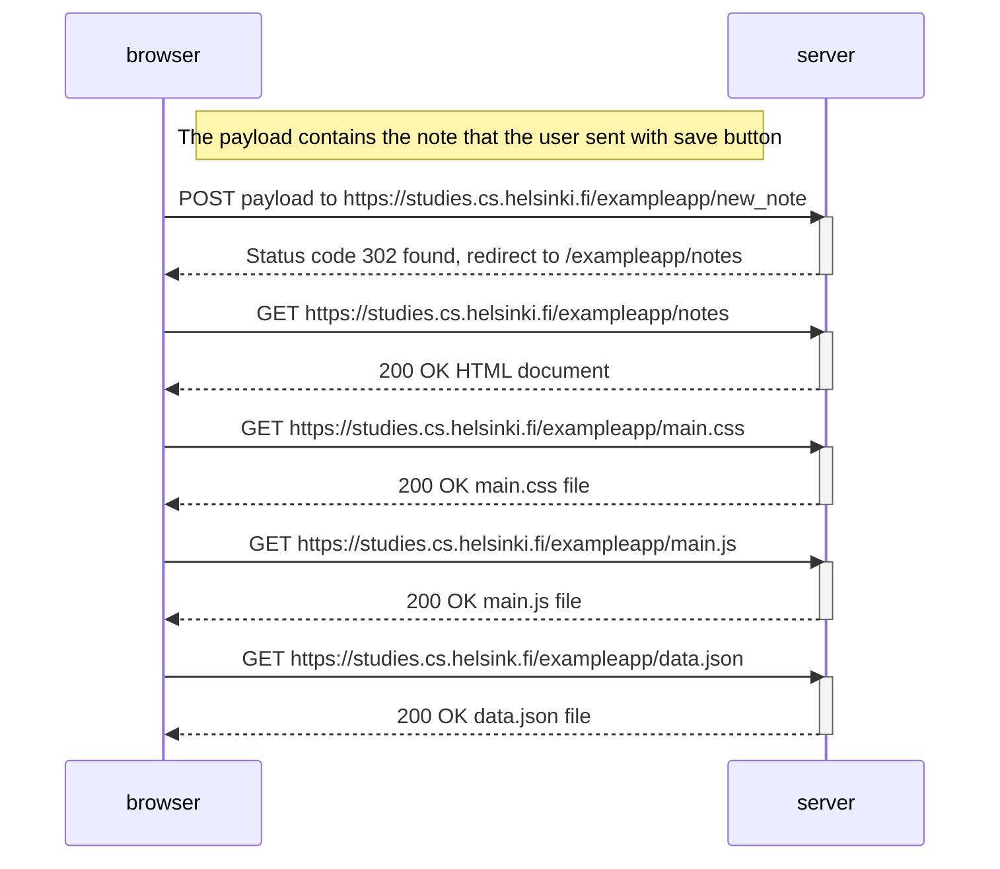

```mermaid
    sequenceDiagram
    participant browser
    participant server

    Note right of browser: The payload contains the note that the user sent with save button
    browser->>server: POST payload to https://studies.cs.helsinki.fi/exampleapp/new_note
    activate server
    server-->>browser: Status code 302 found, redirect to /exampleapp/notes
    deactivate server

    

    browser->>server: GET https://studies.cs.helsinki.fi/exampleapp/notes
    activate server
    server-->>browser: 200 OK HTML document
    deactivate server

    browser->>server: GET https://studies.cs.helsinki.fi/exampleapp/main.css
    activate server
    server-->>browser: 200 OK main.css file
    deactivate server

    browser->>server: GET https://studies.cs.helsinki.fi/exampleapp/main.js
    activate server
    server-->>browser: 200 OK main.js file
    deactivate server
    
    browser->>server: GET https://studies.cs.helsink.fi/exampleapp/data.json
    activate server
    server-->>browser: 200 OK data.json file
    deactivate server
```